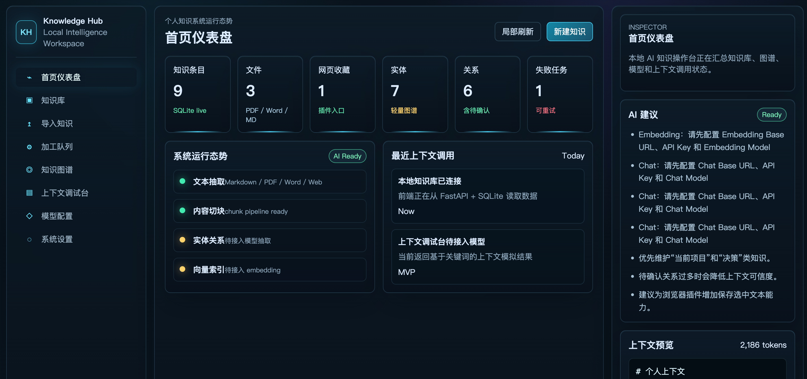
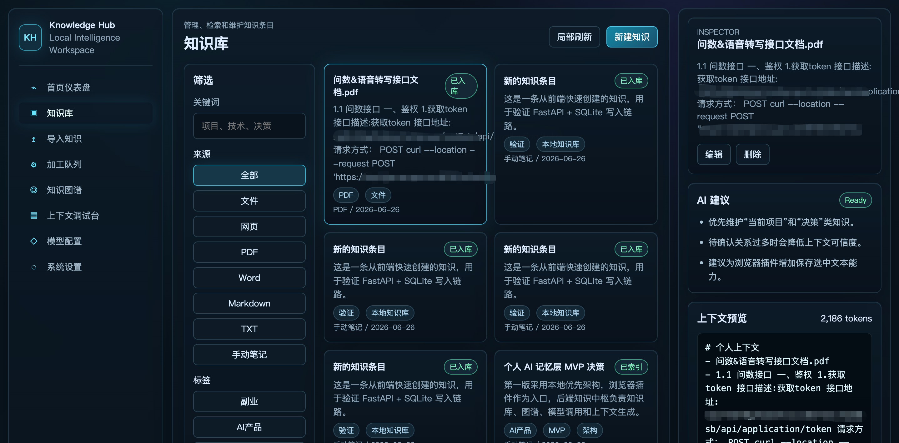
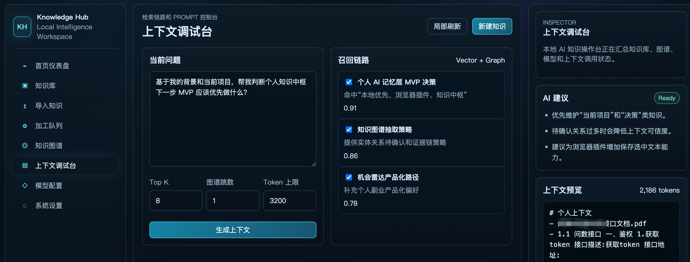
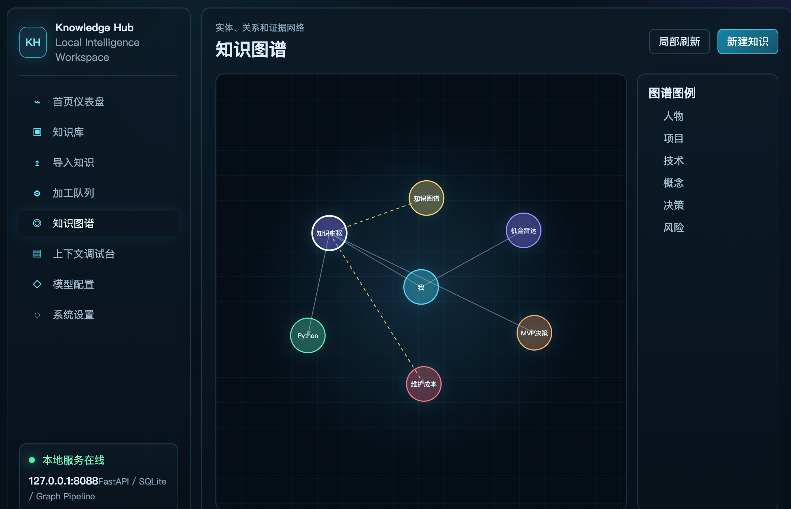

# Personal Knowledge Hub

[English](README.md) | [简体中文](README.zh-CN.md)

> 本地优先的个人 AI 记忆层与知识上下文中枢。

Personal Knowledge Hub 是一个本地优先的个人 AI 记忆层与知识上下文中枢。它不是传统笔记软件，而是面向高频使用 AI 的知识工作者，帮助你把个人资料、项目背景、历史决策、网页收藏和文档知识加工成可检索、可调试、可注入 Web AI 的上下文。

## 为什么做这个项目

通用 AI 很强，但它通常不了解你的个人背景、项目资料、历史决策和长期偏好。结果就是：你需要反复补充上下文，AI 才能给出接近真实需求的回答。

Personal Knowledge Hub 想解决的是这件事：

```text
把散落的个人知识沉淀为本地知识库，经过解析、切块、检索和图谱组织后，生成可解释、可复制、可注入 Web AI 的上下文。
```

## 产品截图

### 首页仪表盘



### 知识库



### 上下文调试台



### 知识图谱



## 功能特性

- 基于 FastAPI、SQLite 和 Vue 的本地优先知识工作台。
- 支持手动笔记、网页、TXT、Markdown、PDF、Word 文档导入。
- 支持本地 Python 文档解析，也可切换到外部 MinerU 解析服务。
- 支持知识切块，并在加工队列中查看处理状态。
- 支持从个人知识中生成 AI 可用上下文，并展示召回命中原因。
- 支持关键词检索与 Embedding + Chroma 向量检索两条路径。
- 支持 Chat 模型和 Embedding 模型分别配置，方便组合不同 OpenAI 兼容厂商。
- 支持用轻量知识图谱展示个人实体、决策、项目和风险。
- 支持浏览器插件保存网页，并将生成的上下文注入 Web AI 对话框。

## 产品模块

```text
首页仪表盘          查看系统状态、知识指标和最近上下文调用
知识库              管理笔记、文档、网页、标签和来源信息
导入知识            添加手动笔记、网页和本地文件
加工队列            跟踪文档解析、切块和后续 AI 加工步骤
知识图谱            展示实体、关系和证据网络
上下文调试台        调试召回结果并生成最终上下文 Prompt
模型配置            配置 Chat、Embedding、MinerU 和 Chroma，保存后立即生效
浏览器插件          保存网页内容，并向 Web AI 对话注入上下文
```

## 仓库结构

本仓库采用 monorepo 结构：

```text
personal-knowledge-hub/
├── backend/              # FastAPI + SQLite 后端
├── frontend/             # Vue 3 + Vite 管理端
├── browser-extension/    # Chrome / Edge 浏览器插件
├── docs/                 # 架构、开发和产品文档
├── .env.example
├── .gitignore
├── README.md             # 英文 README，GitHub 默认展示
└── README.zh-CN.md       # 中文 README
```

## 架构

```text
Browser Extension
        |
        | save page / generate context / insert context
        v
Vue Frontend  <---- REST API ---->  FastAPI Backend
                                      |
                                      | SQLite metadata and knowledge chunks
                                      v
                                  SQLite DB
                                      |
                                      | optional vector index
                                      v
                                    Chroma
                                      |
                                      | optional OpenAI-compatible APIs
                                      v
                           Chat Model / Embedding Model
```

## 快速启动

### 1. 启动后端

```bash
cd backend
python3 -m venv .venv
source .venv/bin/activate
pip install -r requirements.txt
uvicorn app.main:app --host 127.0.0.1 --port 8088 --reload
```

健康检查：

```text
http://127.0.0.1:8088/api/health
```

SQLite、上传文件和 Chroma 运行数据默认存储在 `backend/data/`，该目录已被 Git 忽略。

### 2. 启动前端

```bash
cd frontend
npm install
npm run dev
```

访问：

```text
http://127.0.0.1:5175
```

前端默认请求：

```text
http://127.0.0.1:8088/api
```

如果后端没有启动，页面会显示“本地服务离线”，并继续使用内置模拟数据。

### 3. 构建浏览器插件

```bash
cd browser-extension
npm install
npm run build
```

在 Chrome / Edge 扩展管理页启用开发者模式，然后加载：

```text
browser-extension/dist
```

插件默认连接本地服务：

```text
http://127.0.0.1:8088
```

## 模型配置

进入前端“模型配置”页面后，可以分别配置 Chat 模型和 Embedding 模型，适合不同厂商组合使用。

Chat 模型：

```text
Chat Base URL
Chat API Key
Chat Model
Chat Timeout
```

Embedding 模型：

```text
Embedding Base URL
Embedding API Key
Embedding Model
Embedding Timeout
```

例如可以用 DeepSeek / Qwen 兼容接口做 Chat，用 OpenAI 或本地兼容服务做 Embedding。

## 上下文检索模式

Personal Knowledge Hub 支持两条上下文生成路径：

- 关键词检索：默认模式，不需要模型密钥。
- Embedding + Chroma 向量检索：通过 OpenAI 兼容 Embedding API 对 chunk 向量化，并写入 Chroma。

Chroma 可以在“模型配置”中选择两种连接模式：

- 本地持久化模式：使用 `backend/data/chroma` 或自定义本地路径。
- HTTP 服务模式：连接独立 Chroma Server，可配置 host、port、SSL 和可选 API Key。

切换到向量检索后，点击 `重建向量索引`，即可将已有知识 chunk 写入 Chroma。后续新导入或编辑的知识会自动更新向量索引。

## 文档解析

文档解析模式可以在“模型配置”页面切换，保存后立即生效，不需要重启服务。

- 本地 Python 解析：PDF 使用 `pypdf`，Word 使用 `python-docx`。
- MinerU 服务解析：调用外部 HTTP 文档解析服务。

MinerU 调用约定：

```text
POST {MinerU 解析接口地址}
Content-Type: multipart/form-data
Authorization: Bearer <MinerU API Key，可选>
files: 上传文件
model: mineru-vl
only_md: true
```

`MinerU 解析接口地址` 支持填写完整私有化接口，例如 `/openapi/v1/ocr/mineru-parser`。服务可以流式返回 Markdown 文本，也可以返回包含 `text`、`content`、`markdown`、`md` 或 `data` 字段的 JSON。

## API 概览

```text
GET    /api/health
GET    /api/dashboard
GET    /api/knowledge-items
POST   /api/knowledge-items
PATCH  /api/knowledge-items/{item_id}
DELETE /api/knowledge-items/{item_id}
POST   /api/import/manual
POST   /api/import/webpage
POST   /api/import/file
GET    /api/jobs
GET    /api/graph
POST   /api/context/generate
GET    /api/model-config
POST   /api/model-config
POST   /api/model-config/test-chat
POST   /api/model-config/test-embedding
POST   /api/vector/rebuild
```

## 文档

- [Architecture](docs/ARCHITECTURE.md)
- [Development](docs/DEVELOPMENT.md)
- [Product PRD](docs/PRD.md)
- [Security](docs/SECURITY.md)

## Roadmap

后续计划：

- 实现真正的加工 worker，支持摘要、标签、实体抽取和关系抽取。
- 优化关键词 + 向量 + 图谱信号的混合检索。
- 完善知识图谱编辑、关系证据和确认流程。
- 增加 Prompt 模板和上下文压缩。
- 支持本地大模型。
- 可选的多设备同步。

更详细的公开路线图会在项目稳定后补充。

## 开源注意

请不要提交：

- `.env`、API Key 或模型密钥
- `backend/data/` 下的 SQLite 运行数据
- 上传的个人文件
- Chroma 运行数据
- `node_modules/`
- 前端或插件的 `dist/` 构建产物
- 真实个人文档或私密知识库数据

## License

MIT
